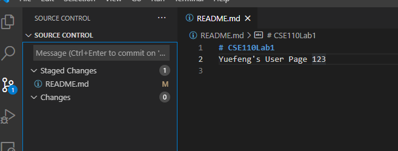

# CSE110Lab1

## Yuefeng Huang

### first markdown try

**this is bold**

*italicized*

~~mistake~~

**nested _italic_**

***important***



> This is coded

These are code quoting:
```
cout << "Hello World";
```

This is my [linkedin page](https://www.linkedin.com/in/yuefeng-huang/).

[readme file](CSE110Lab1/readme.md)

My habbits:
-soccer
-video game
-sleep

Drinks:
1.Coke
2.Milktea
3.Coffee

1.nested lists
  -inner one
    -inner inner one
    
Goal: @alexyuefeng
- [x] Get an intern job next summer
- [ ] Get a full time job
- [ ] Graduate

